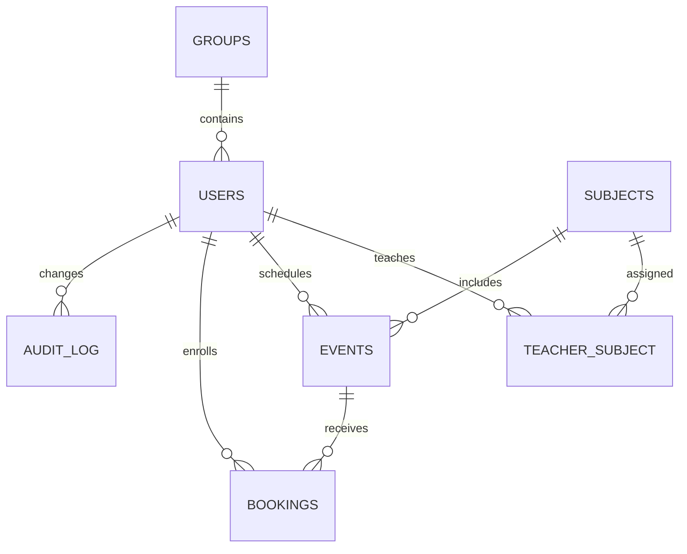

# Архитектура и принятые правила

Приложение предназначено для дополнительных очных консультаций и учебных занятий.
Слово «курс» в профиле означает год обучения, а запись относится к конкретному занятию
по дисциплине. Видеоуроки, оплата и полноценная LMS не входят в текущую поставку.

## Данные

У студента одна текущая группа. Отдельная таблица группа/студент для отношения
один-ко-многим не требуется: `users.group_id` обеспечивает связь без дублирования.
Группу можно завести пустой перед импортом её студентов.
Таблица `teacher_subject` реализует несколько преподавателей у дисциплины и несколько
дисциплин у преподавателя. `audit_log` хранит исправления, сбросы, изменения, выгрузки.
Выходной журнал строится из `bookings`, `events` и `users`; экспорт отражает актуальные
ФИО и учебные данные. История переводов по группам отдельной сущностью не ведётся.

## Авторизация

Уникальность аккаунта — пара `(login, role)`. Корпоративный домен нормализуется:
`kurenkov.ee@misis.ru` и `kurenkov.ee` — один логин. Регистр логина не влияет на вход;
регистр пароля важен. Роль определяется совпавшим паролем. Пароль не может совпадать
с текущим или начальным паролем другой роли того же логина, включая отключённую роль.

Поля логина и пароля должны быть непустыми. Девять ошибок учитываются без блокировки.
Десятая ставит паузу 5 минут. Попытки во время паузы не увеличивают счётчик.
После её окончания счётчик сохраняется равным 10: ещё пять ошибок блокируют логин
до ручного сброса. Успешный вход до постоянной блокировки очищает счётчик.
Для неизвестного логина счётчик относится именно к введённой строке; определить
«настоящий логин», который человек имел в виду, система не может.

`LoginGate` хранится в PostgreSQL, а не в памяти процесса. `INSERT ON CONFLICT` и
`SELECT FOR UPDATE` сериализуют параллельные попытки одного логина. Блокировка общая
для преподавателя и администратора с одним логином. Счётчик не привязан к IP или браузеру.
Слишком длинные поля и некорректные запросы формы отклоняются до аутентификации.

Пароли хешируются scrypt. В БД хранятся текущий и начальный хеши, а не исходные пароли.
При сбросе администратором восстанавливается начальный хеш выбранной роли. Все сессии
этого логина отзываются через `session_version`. Установленный администратору через
консоль пароль становится новым начальным паролем этой роли.

## Запись и пересечения

Время хранится как PostgreSQL `timestamptz`, приложение показывает Asia/Yekaterinburg.
Интервалы полуоткрытые: `[начало, конец)`. 16:00–17:00 и 17:00–18:00 совместимы.
16:00–17:00 и 16:30–17:30 пересекаются. Запись разрешается при `начало >= сейчас + 48ч`.
Лимит меняется через BOOKING_LEAD_HOURS; в поставке стоит 48.

Создавать занятия можно только по закреплённым дисциплинам; одно занятие рассчитано
на один курс и при необходимости одну группу. Длительность — до 12 часов, места — 1–500.
Студент записывается после заполнения ФИО и при совпадении курса/группы.
Повторная активная запись запрещена. После отмены тот же студент может записаться снова.

При записи блокируются строка студента и строка занятия. Вместимость проверяется
после блокировки занятия, поэтому два запроса на последнее место не должны пройти вместе.
Отдельные `EXCLUDE USING gist` ограничения запрещают пересечения преподавателя
в `events` и студента в `bookings`. Составной внешний ключ гарантирует соответствие
времени записи времени занятия. Эти SQL-ограничения действуют и при прямой записи в БД.
Лимит мест, роли участников и дедлайн дополнительно проверяет сервис приложения;
обход этих правил прямым SQL из pgAdmin находится вне пользовательского сценария.

Занятие после первой записи нельзя перенести путём изменения времени, преподавателя,
дисциплины, курса или группы. Нужно отменить его и создать новое. Аудиторию, описание
и вместимость можно изменить, сохраняя число мест не меньше числа активных записей.
При отмене занятия все его активные записи отменяются в той же транзакции.
Студент может отменить запись до начала занятия, в том числе после закрытия записи за 48ч.

## Администрирование

ФИО новый студент сохраняет один раз с подтверждением. Достоверность первичного
ввода подтверждает студент. Администратор исправляет ФИО по личному обращению,
указывая основание; старое и новое значения сохраняются в журнале.
Приложение не устанавливает юридические пределы ответственности работников.

Логин и роль созданного аккаунта неизменяемы через форму: ошибочный аккаунт отключают
и создают корректный. Удаление заменено отключением/архивом, чтобы сохранить журнал.
Отключение преподавателя отменяет будущие занятия, отключение студента — будущие записи.
Собственный администраторский аккаунт отключить нельзя. Для коррекции группы или курса
студента сначала отменяются несовместимые будущие записи.

Назначение дисциплин преподавателям, создание любых аккаунтов, импорт и доступ к
истории изменений доступны только администратору. Преподаватель видит только своих
участников, студент — только свои записи. Публичной регистрации и восстановления
по email нет: текущий порядок предусматривает личное обращение к администратору.

## Поставка и границы

Настройки, журнал, экспорт Excel, импорт студентов из XLSX, миграции и средства запуска реализованы.
Мобильный интерфейс адаптивный. Устанавливаемая PWA, email-уведомления, интеграция
с вузовской SSO и автоматическая синхронизация с 1С — направления дальнейшего развития.
Смену пароля по умолчанию перед использованием можно сделать обязательной через
FORCE_INITIAL_PASSWORD_CHANGE=1. В деморежиме это добровольное действие.
